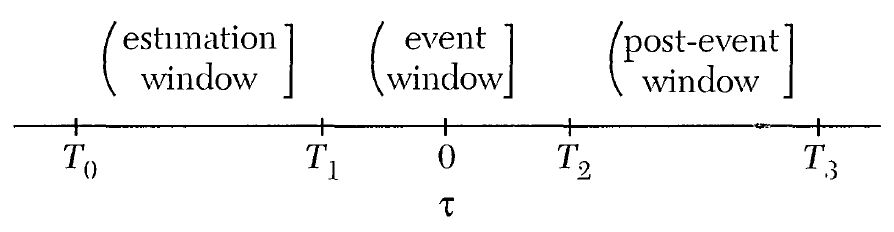

# Motivation

## Phenomenon

According to the efficient market theory, 
stock prices in a semi-strong market factor all material **public information**.

That is any publicly issued financial announcement 
has the potential of influencing the **demand** for various stocks 
and subsequently affecting their **prices**.

**So, what is the impact of quarterly financial announcement on stock price?**

##

```r

```

## Event Study in Corporate Finance

To describe and evaluate the effects as possible as accurate and impartial,
we select the event study methodology (ESM) in our quantification process.

The fundmental is to find the **abnormal return** ($AR$) 
attributed to firm's quarterly financial announcement.

For firm $i$ and event date $t$, ${\it AR}_{it}$ represents the difference 
between the actual stock return $R_{it}$ and the expected return, $E(R_{it})$, 
predicted by model.
\[AR_{it} = R_{it} - E(R_{it}). \]


## Assumption & Hypothesis

\begin{block}{Semi-strong form of market efficiency}
 Current stock prices adjust rapidly to the release of all new public information.
 \end{block}


\begin{block}{Original null hypothesis}
Special event such as quarterly financial announcement have no effects on 
mean level of security returns.
That is, $E({\it AR}_{it}) = 0$.
\footnote{The empirical results in Patell(1976) indicate that 
the disclosure of corporate forecasts of annual earnings
were accompanied by significant price adjustments.}
\end{block}


## Motivation

We want to acquire the answers to these questions,

1. Is there existing significantly heterogeneous 
among stocks in chinese A-share markets?

2. The release of quarterly earnings announcement
whether impact the daily returns of stocks or not.
The investor behavior is rational? 

3. How to explain the $\alpha$ brought by quarterly earnings announcement?

4. Assuming that there existed any heterogeneity, 
does it resulted in different level of $\alpha$?


# Modeling the daily returns

## Measuring the expected returns (${\it ER}_{it}$)

The starting point is to calculate the **actual daily returns** of firm $i$ at date $t$,
\[
R_{it} = \mbox{log} \frac{P_{it}}{P_{it-1}},
\]
where log is the natural logarithm, $P_{it}$ is the closing price.


Then, we choose the Fama-French 3-Factor model in fama (1993) 
to estimated the expected return, $E(R_{i\tau})$,
\[
R_{i\tau}-R_{f\tau} = \alpha_i + \beta_{i}(R_{m\tau} - R_{f\tau}) +
s_{i}\text{SMB}_\tau + h_{i}\text{HML}_\tau +
\varepsilon_{i \tau} .
\]


## Event date, $\tau$ 

Note that we use $\tau$ as the time index rather than $t$
due to the earnings revealed date among firms are different.

```{r echo=FALSE}
EDSZ1st <- as.data.frame(read.csv("EDSZ1st.csv",header = T))
EDSZ3rd <- as.data.frame(read.csv("EDSZ3rd.csv",header = T))
EDSH1st <- as.data.frame(read.csv("EDSH1st.csv",header = T))
EDSH3rd <- as.data.frame(read.csv("EDSH3rd.csv",header = T))
EDSZ <- cbind(EDSZ1st[sample(2:nrow(EDSZ1st), 5),], EDSZ3rd[sample(2:nrow(EDSZ3rd), 5),])
EDSH <- cbind(EDSH1st[sample(2:nrow(EDSH1st), 5),], EDSH3rd[sample(2:nrow(EDSH3rd), 5),])
ED <- rbind(EDSZ, EDSH)
print(ED, row.names=FALSE)
```


## Measuring the expected returns (${\it ER}_{i\tau}$)

It states that the real daily return of a stock 
in excess of the risk-free rate, $R_{i\tau}-r_\tau^f$, 
is explained by three risk factors,

- $R_{m\tau} - R_{f\tau}$, Market factor, the return on the value-weight market portfolio 
minus the risk-free return.

- $\text{SMB}_\tau$, Size factor, the return on a diversified portfolio of small stocks
minus the return on a diversified portfolio of big stocks.

- $\text{HML}_\tau$, Value factor, the difference between the returns on 
diversified portfolios of high and low B/M stocks.


## A three-factor model in china

We follow the procedure used by Liu et al. (2019) to construct size and value factors,
\[
SMB = \frac{1}{3} (S/V + S/M + S/G) - \frac{1}{3} (B/V + B/M +B/G),
\]
\[
VMG = \frac{1}{2} (S/V + B/V) + \frac{1}{2} (S/G + B/G).
\]

At there, size and value factors, denoted as $SMB$ (small-minus-big)
and $VMG$ (value-minus-growth), combine the returns on six portfolios.


## The timeline

The estimation window is used for **estimating the parameters**,
this allows $AR_{i\tau}$ to be calculated within the event window.





## Calculate abnormal Return (${\it AR}_{i\tau}$)

After we obtain the estimator from estimation window, 
for firm $i$ and event date $\tau$, 
we can decompose a return in event window as
\[
R_{i\tau}^{*} = E(R_{i\tau}^{*} | X_\tau) + \varepsilon_{i\tau}^{*},
\]
where
$R_{i\tau}$ and $E(R_{i\tau})$ denote 
the actual and expected returns respectively,
the symbol $*$ means the calculation proceed in event window.


### Calculate abnormal Return (${\it AR}_{it}$)

Vitally essential, We define that 
\[AR_{i\tau} = R_{i\tau}^* - E(R_{i\tau}^* | X_\tau) = \varepsilon_{i\tau}^*. \]


Namely, in event studies, $\varepsilon^*$, 
not captured by the model due to a abnormal event,
is called the abnormal return ${\it AR}$.


## Statistical properties of $AR$ & ${\it CAR}$


### The Distribution of AR

Under the null hypothesis that 
the event has no influence on the mean and variance of returns,
we can obtain the distribution of AR,
\(AR_{i} \sim N(0, V_i),\)
where
\[
\begin{aligned}
V_i & = {\it Var}( AR_{i}) = E\left[\hat{\varepsilon}_{i}^{*} \varepsilon_{i}^{*^{\prime}} \right] \\
& =E\left[\left[\varepsilon_{i}^{*}-X_{i}^{*}\left(\hat{\beta}_{i}-\beta_{i}\right)\right]
\left[\varepsilon_{i}^{*}-X_{i}^{*}\left(\hat{\beta}_{i}-\beta_{i}\right)\right]^{\prime} \right] \\
& = E\left[\varepsilon_{i}^{*} \varepsilon_{i}^{*^{\prime}} - \varepsilon_{i}^{*} \left(\hat{\beta}_{i}-\beta_{i}\right)^{\prime} X_{i}^{*}
- X_{i}^{*}\left(\hat{\beta}_{i}-\beta_{i}\right) \varepsilon_{i}^{*^{\prime}} \right. \\ 
& \quad \left. + X_{i}^{*}\left(\hat{\beta}_{i}-\beta_{i}\right) \left(\hat{\beta}_{i}-\beta_{i}\right) X_{i}^{*^{\prime}} \right] \\
& = I \sigma_{\varepsilon_{i}^{*}}^{2}+X_{i}^{*}\left(X_{i}^{*'} X_{i}\right)^{-1} X_{i}^{*^{\prime}} \sigma_{\varepsilon_{i}}^{2}.
\end{aligned}
\]


### The Cumulative Abnormal Return (${\it CAR}$)


Define ${\it CAR}_i(\tau_1,\tau_2)$ as the sample sum of included ${\it AR}_{i\tau}$ from $\tau_1$ to $\tau_2$,
\begin{equation}
{\it CAR}_i(\tau_1, \tau_2) = \sum_{\tau=\tau_1}^{\tau_2} {\widehat{AR}_{i\tau}}.
\end{equation}


Under $H_0$ ie. given event has no impact, the distribution of ${\it CAR}$ is
\[\widehat{\it CAR}_i(\tau_1, \tau_2) \sim N (0, \sigma^2_i(\tau_1, \tau_2) ),\]
where
\(\sigma^2_i(\tau_1, \tau_2) = \gamma^{\prime} V_i \gamma\)
and $\gamma$ is a vector of ones in $\tau_1$ to $\tau_2$ and zeros elsewhere.


### The Cumulative Abnormal Return (${\it CAR}$)

The test statistics of ${\it CAR}$ becomes
\[
\frac{\widehat{\it CAR}_i(\tau_1, \tau_2)}{\hat \sigma_i(\tau_1, \tau_2)}
\sim t[(\tau_2 - \tau_1 +1)-2].
\]

For large estimation window ($\tau_2 - \tau_1 +1 > 30$),
it is distributed as standard normal distribution.


### The Average $AR$ and ${\it CAR}$ over securities

Assume that there is no correlation across the $AR$ of different securities,
given $N$ securities, the sample aggregated $AR_\tau$ is
\[
\overline{AR}_\tau = \frac{1}{N} \sum_{i=1}^N \widehat{AR}_{i\tau},
\]
and
\[
\overline{CAR}_i(\tau_1, \tau_2) = \sum_{\tau=\tau_1}^{\tau_2} {\overline{AR}_{\tau}}.
\]


### The Distribution of average ${\it CAR}$

Under $H_0$, we have
\[\overline{CAR}(\tau_1, \tau_2) \sim N(0, \bar \sigma^2(\tau_1, \tau_2),\]
where $\bar \sigma^2_i(\tau_1, \tau_2)$ is unknown and can be consistently eatimated by
\[
\hat{\bar\sigma}^2(\tau_1, \tau_2) = 
\frac{1}{N^2} \sum_{i=1}^{N} \hat \sigma^2_i (\tau_1, \tau_2)
\]


### Modifying the null hypothesis

Original null hypothesis is event haved no effect on mean and variance of security returns.
A modified null hypothesis would be: **event has no effect on mean return only,** 


we remove the reliance on past returns in caulating variance to construct the test statistics,
\[
\frac{\overline{\it CAR}(\tau_1, \tau_2)}{\hat{\bar\sigma}(\tau_1, \tau_2) }
\stackrel{a}{\sim} N(0, 1)
\]
where
\(
\hat{\bar\sigma}(\tau_1, \tau_2)
= \frac{1}{N^2} \sum_{i=1}^{N}\left[ {\it CAR}_i(\tau_1, \tau_2) - \overline{\it CAR}(\tau_1, \tau_2)  \right]^2.
\)


### Review of above regular steps in an event study

1. Exactly define the event and identify the exact event date

2. Determine the estimation and event window

3. Determine the estimation method for expected return calculation

4. Calculate abnormal returns (AR) and cumulative abnormal returns (CAR)

5. Define null and alternative hypotheses, then test for statistical significance

6. Interpret the empirical results and draw conclusions


# Analysis of Chinese A-share Markets


## OLS & PLS Estimators


### Define estimation window and event window

We define the length of estimation window as 240 days,
and the event window are 30 days before and after
the disclosure of quarterly earnings announcement of firms.


### The correlation coefficient matrix

The daily data used here from Wind and CSMAR in third Quarter 2017.

Follwing result is the correlation coefficient between explanation variables (the three factors in FF 3-factor model) of a random stock.

```{r echo=FALSE}
PD.est <- as.data.frame(read.csv("Panel.3.1st.csv",header = T))
T <- 240L
cor(PD.est[(1:T) + T*sample(1:length(unique(PD.est[,1])), size = 1), 4:6])
```


### Ordinary least squares estimator

```{r echo=FALSE}
options(digits=2)
PDcoef <- as.data.frame(read.csv("PDcoef.csv",header = T))
print(PDcoef[sample(1:1544, 10),],row.names=FALSE)
```


### The Distribution of OLS Estimator

```{r echo=FALSE, warning=FALSE,message=FALSE}
library(ggplot2)
require(grid)
library(latex2exp)
PDcoef <- as.data.frame(read.csv("PDcoef.csv",header = T))

a <- qplot(PDcoef[,3], xlab=TeX('$\\beta_1$ of MKT'), ylab = "count",bins=50, xlim = c(-3,3), ylim = c(0,250))
b <- qplot(PDcoef[,4], xlab=TeX('$\\beta_2$ of SMB'), ylab = "count",bins=50, xlim = c(-3,3), ylim = c(0,250))
c <- qplot(PDcoef[,5], xlab=TeX('$\\beta_3$ of HML'), ylab = "count",bins=50, xlim = c(-3,3), ylim = c(0,250))

grid.newpage()
pushViewport(viewport(layout = grid.layout(1,3)))
vplayout <- function(x,y){viewport(layout.pos.row = x, layout.pos.col = y)}
print(a, vp = vplayout(1,1))
print(b, vp = vplayout(1,2))       
print(c, vp = vplayout(1,3)) 
```


### Economic Interpretation of $\beta_1$

\[
E(R_{i\tau}) = \hat \mu_i + \hat \beta_{1i}(r_{\tau}^m - r_{\tau}^f) +
\hat \beta_{2i}(r_\tau^\text{SMB}) + \hat\beta_{3i}(r_\tau^\text{HML})
\]

In CAPM and FF 3-factor model, $\beta_{1i}$ is a measure of the volatility, 
or systematic risk, of an individual stock in comparison to 
the unsystematic risk of the entire market.

- $\beta_1 < 0$,
Asset price moves in the reverse direction to unsystematic risk

- $0 < \beta_1 < 1$,
Asset moves in the same direction, but in a lesser amount than the benchmark

- $\beta_1 > 1$,
\textcolor{red}{Sensitivity} of these assets are limber(rich in elasticity).


### Identify the Latent Structure


Recall that the basal OLS estimator are obrained by minimizing objective function
\[\min_{\boldsymbol \beta} \, Q(\boldsymbol{\beta})=\sum_{i=1}^{N} \sum_{t=1}^T\left(y_{it}- \boldsymbol{x}_{it}^\prime \boldsymbol{\beta}\right)^{2}=\|\mathbf{y}-\mathbf{X} \boldsymbol{\beta}\|^{2}.\]


### Automatic classificaation by penalized least squares

We apply the Lasso method to cluster the stocks in Chinese A-share markets 
by adding a complex penalty term
\begin{equation}
\min_{\boldsymbol \beta} \left[ Q(\boldsymbol{\beta}) +
\frac{\rho}{N} \sum_{i=1}^N \textstyle\prod_{k=1}^{K}
\parallel \! \beta_{i} -  \alpha_{k} \! \parallel \right].
\end{equation}


The penalty term in the multiplicative expression 
\textcolor{red}{shrinks} the individual-level parameter vector $\beta_{i}$ 
to a partical unknown group-level parameter vector $\alpha_{k}$, 
and the number of group is decide by the iterative algorithm in Su(2016).
\footnote{Su, L., Shi, Z., \& Phillips, P. C. (2016). Identifying latent structures in panel data. Econometrica, 84(6), 2215-2264.}
Here, we push the punishment on MKT factor $\beta_{1i}$.


### Penalized least squares estimator


#### Coefficient
```{r echo=FALSE, warning=FALSE}
options(digits=4)
coef <- as.data.frame(read.csv("coef.g.csv",header = T, as.is = TRUE))
rownames(coef) <- c("MKT", "SMB", "HML")
coef <- coef[,c(1,4,7)]
colnames(coef) <- c("g1", "g2", "g3")
coef
```

#### t-value
```{r echo=FALSE, warning=FALSE}
options(digits=4)
coef <- as.data.frame(read.csv("coef.g.csv",header = T, as.is = TRUE))
rownames(coef) <- c("MKT", "SMB", "HML")
t <- coef[,c(3,6,9)]
colnames(t) <- c("g1", "g2", "g3")
t
```


####

\begin{table}[htbp]
  \small
  \centering
  \caption{Penalized least squares estimator}
    \begin{tabular}{lccc}
    \toprule
                    &     Group A        &      Group B      &     Group C    \\
    \midrule
    MKT             &     1.056***       &      0.583***     &     0.213***   \\
                    &     (132.26)       &      (33.15)      &     (5.29)     \\
    SMB             &     0.686***       &      0.591***     &     0.267***   \\
                    &      (46.37)       &      (24.09)      &     (9.48)     \\
    HML             &     -0.398***      &      -0.188***    &     -0.087     \\
                    &     (-21.62)       &      (-5.41)      &     (-1.41)    \\
    obs             &        1165        &      312          &      67        \\
    \bottomrule
    \multicolumn{3}{l}{\scriptsize } \\
    \end{tabular}
\end{table}

###

.pdf)

###


### Path of group-CAR

```{r echo=FALSE, warning=FALSE}
library(ggplot2)
CAR.g <- as.data.frame(read.csv("CAR.g.csv" ))
CAR.g$group <- as.factor(CAR.g$group)

ggplot(CAR.g, aes(time, CAR, colour = group)) + geom_path() +
  labs(title = "Figure: Path of cumulative abnormal return for quarterly earning \nannouncements from event day -30 to event date +30 for different groups", x="Time line", colour="PLS") + 
  theme(plot.title = element_text(size=15)) +
  scale_colour_discrete(labels=expression(beta[1] == 1.056, beta[1] == 0.583, beta[1]== 0.213))

```


### Analysis of power


## Behavioral Finance


### Extrapolation-based model

Short-term fluctuations are correlated to contemporaneous price changes 
and thus may move security prices.

Return extrapolation is the idea that 
people’s expectation of the future return of an asset, asset class, or fund 
is a weighted average of the past returns of securities, where the weights on the past returns are positive and larger for more recent past returns.


### Trading Strategies

- Value and growth(glamour) investing

- Momentum and contrarian investing

- Speculative trading


### Investor sentiment

In the cross-section, firms with rich information show drift in intangible returns 
while those with scarce information show reversal. 
And overreaction theories state that overreaction to good news and 
underreaction to bad news.


#### Explanatory Variable in investor sentiment

- Market liquidity(trading volume)

The less liquid stocks tend to be more severely overpriced.

- Consumer confidence


# Conclusion Drawing


###


### 

\begin{center}
\Huge{Thank You !}
\end{center} 